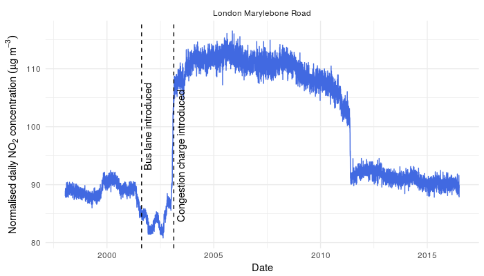
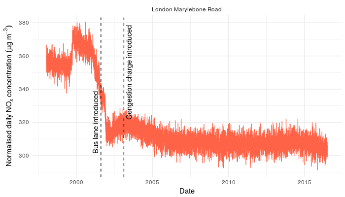

# **normalweatherr**

## Introduction

**normalweatherr** is an R package to conduct meteorological/weather normalisation on air quality so trends and interventions can be investigated in a robust way. 

## Steps for usage

  1. Gain a mostly complete time-series of a numeric value with other variables which could explain variation of the numeric value. In the air quality domain, `value` will usually be a pollutant concentration and the other variables will be meteorological variables such as wind speed, wind direction, atmospheric temperature, and atmospheric pressure. However other variables could be used which might explain pollutant concentrations. The time-series will usually be at hourly or daily resolution. 

  2. A statistical model is built which uses meteorological and time variables to explain pollutant concentrations. Any statistical model which can represent interactions and non-linear relationships among the predictors could be used. But here, random forest (with [**randomForest**](https://cran.r-project.org/web/packages/randomForest/index.html)), support vector machines (with [**kernlab**](https://cran.r-project.org/web/packages/kernlab/index.html)), generalised boosted regression models (with [**gbm**](https://cran.r-project.org/web/packages/gbm/index.html)), and generalised additive models (with [**mgcv**](https://cran.r-project.org/web/packages/mgcv/index.html)) are used. 
  
  3. Evaluate performance of the statistical model. Depending on the type of model and input data, this can include:
    
    - Model performance metrics such as MSE and R2. 
    
    - Importance matrices. 
    
    - Partial dependency plots. 
    
    - Test the [bias-variance trade off](https://en.wikipedia.org/wiki/Bias%E2%80%93variance_tradeoff) by using withheld data not used in the model generation but were contained in the original set (the [training and test sets](https://en.wikipedia.org/wiki/Test_set)). 
  
  3. Randomly allocate the meteorological and time variables, but excluding the trend component used in the model to predict concentrations based on these sampled variables. When this process is repeated hundreds of times and then aggregated, the result is a prediction which represents "average" meteorology/weather.
  
  4. Continue on with appropriate trend analysis. Breakpoints, Theil-Sen estimations, etc...

## Examples

The plots below show meteorological normalised trends for NO2 and NOx at London Marylebone Road between 1997 and 2016. Due to the normalisation procedure, these plots represent the *emissions* at London Marylebone Road. 

These trends are not suitable for formal trend tests because they are not monotonic, *i.e.* they are not constantly changing with time. However, the breakpoints can be explained by changes in traffic management. 

NO2 shows an increase in emissions when the London congestion charge was introduced. Although this may be counter-intuitive, it can be explained by a rather large increase in bus traffic. Diesel buses in the early 2000s also emitted more NO2 than passenger cars. The reason for the abrupt decrease in 2012 is unknown at the moment. 

The NOx trend demonstrates that despite all the efforts gone into emission control, NOx emissions at London Marylebone Road have remained stable since the early 2000s. 

## See also

  - [**deweather**](https://github.com/davidcarslaw/deweather)
